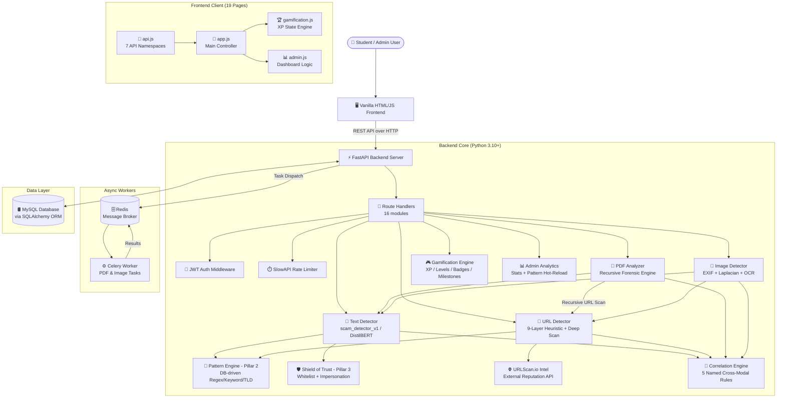
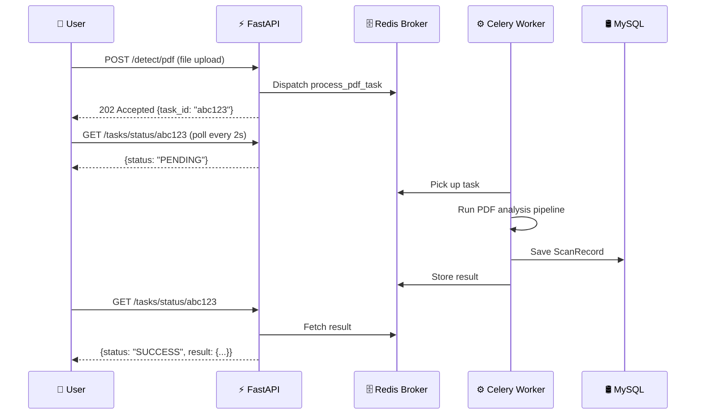
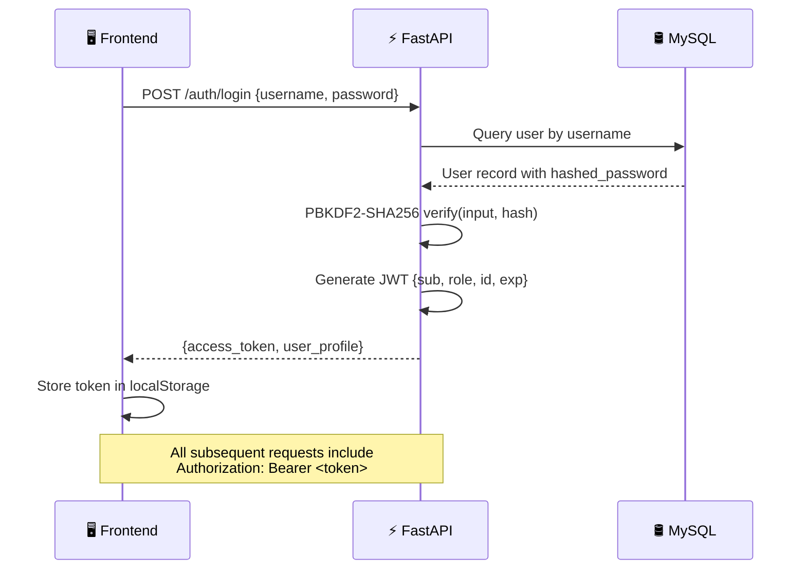

# System Architecture — CyberShield-EDU

> A comprehensive, in-depth architectural overview of the CyberShield-EDU platform, covering every layer of the system from the client-side presentation tier down to the data persistence layer, asynchronous task processing, and cross-service orchestration.

---

## Table of Contents

1. [Architectural Philosophy](#1-architectural-philosophy)
2. [High-Level Architecture Diagram](#2-high-level-architecture-diagram)
3. [Frontend (Client-Side) Architecture](#3-frontend-client-side-architecture)
4. [Backend (Server-Side) Architecture](#4-backend-server-side-architecture)
5. [AI Inference Layer](#5-ai-inference-layer)
6. [Asynchronous Task Processing Layer](#6-asynchronous-task-processing-layer)
7. [Data Persistence Layer](#7-data-persistence-layer)
8. [Cross-Service Orchestration](#8-cross-service-orchestration)
9. [Data Flow Architecture](#9-data-flow-architecture)
10. [Security Architecture](#10-security-architecture)
11. [Deployment Architecture](#11-deployment-architecture)

---

## 1. Architectural Philosophy

CyberShield-EDU is built on a **modern, decoupled frontend-backend architecture** following a layered design pattern with distinct tiers for presentation, business logic, AI inference, and data persistence. The system's design is governed by five key architectural principles:

### 1.1. Decoupled Frontend-Backend
The presentation layer (HTML/CSS/JavaScript) is completely separated from the business logic layer (FastAPI). Communication happens exclusively through RESTful HTTP APIs. This decoupling provides several advantages:
- **Independent Deployment:** The frontend can be served from any static file server (Nginx, Apache, S3) while the backend scales independently.
- **Technology Independence:** The frontend team can use any framework in the future without modifying the backend.
- **Parallel Development:** Frontend and backend features can be developed and tested in parallel against agreed-upon API contracts.

### 1.2. Service-Oriented Backend
The backend is organized around discrete **service classes**, each encapsulating the logic for a specific detection domain (text, URL, PDF, image). These services are:
- **Stateless:** They maintain no per-request state, making them safe for concurrent access by multiple API handlers simultaneously.
- **Composable:** Services can invoke each other freely, enabling deep cross-service orchestration (e.g., the PDF analyzer invoking the URL detector for every embedded link it discovers).
- **Testable:** Each service can be tested in isolation with mock dependencies.

### 1.3. Singleton Model Loading
AI models (DistilBERT, ~250MB) are loaded **once** during application startup and stored as module-level singletons. This eliminates the per-request overhead of model initialization, reducing inference latency from ~30 seconds (cold load) to ~200-500ms (pre-loaded inference). The startup event handler in `main.py` triggers pre-loading:
```python
@app.on_event("startup")
async def startup_event():
    logger.info("🚀 Pre-loading AI models...")
    text_detector.load_model()  # Singleton initialization
```

### 1.4. Asynchronous Processing
Resource-intensive operations (PDF analysis with recursive URL scanning, image OCR with texture analysis) are offloaded to **Celery background workers** through a Redis message queue. This ensures:
- The API response time remains under 500ms even for complex analyses.
- The UI never freezes waiting for a 30-second PDF scan.
- Workers can be scaled horizontally by adding more Celery instances.

### 1.5. Dynamic Correlation Engine
CyberShield-EDU v2.1.0 introduces a **Multi-Modal Correlation Layer**. While individual services detect signs of a scam, the `CorrelationService` analyzes the *co-occurrence* of traits (e.g., an Academic Category + a Financial Intent). This prevents "Internship" keywords from flagging legitimate content while catching sophisticated "Comment Bait" or "Fee Scams."

### 1.6. Database-Driven Configuration & Thresholds
Detection rules, scam keywords, threat patterns, and **sensitivity thresholds** are stored in the database. 
- **Dynamic Thresholding**: Administrators can adjust the `low` (Safe -> Suspicious) and `high` (Suspicious -> Scam) thresholds in real-time through the Admin Panel.
- **Config Helper**: A `ConfigHelper` utility provides a sub-second cached interface to these settings, ensuring that high-traffic scan routes never incur database latency penalties.

---

## 2. High-Level Architecture Diagram



---

## 3. Frontend (Client-Side) Architecture

### 3.1. Technology Stack
| Component | Technology | Purpose |
|:---|:---|:---|
| Structure | HTML5 (Semantic) | 19 distinct pages covering all platform functions |
| Styling | Vanilla CSS3 | Glassmorphism design system with Light/Dark themes |
| Logic | Vanilla JavaScript (ES6+) | No frameworks; 4 modular JS files |
| Typography | Google Fonts (Inter/Outfit) | Modern, legible typefaces |

### 3.2. Page Structure
The frontend implements a **hub-and-spoke navigation model** with a persistent header bar:

| Page | File | Purpose |
|:---|:---|:---|
| Landing | `index.html` | Entry point and navigation hub |
| Detection Hub | `detector.html` | Multi-tab interface for all 4 scan types |
| URL Scanner | `url-scan.html` | Dedicated URL deep analysis |
| PDF Analyzer | `pdf-scan.html` | PDF document upload and forensic report |
| Image Forensics | `image-scan.html` | Image upload with forensic audit results |
| Education Hub | `education.html` | Awareness content and threat modules |
| Academy | `academy.html` | Gamified learning dashboard |
| Quiz | `quiz.html` | Interactive "Spot the Scam" challenges |
| Phish Sim | `phish-sim.html` | Phishing email simulation |
| Scenarios | `scenarios.html` | Extended simulation scenarios |
| Scan History | `history.html` | Personal audit trail of all scans |
| Settings | `settings.html` | Profile, theme, and preferences |
| Admin Panel | `admin.html` | Analytics and rule management |
| Developer | `developer.html` | API key management and documentation |
| Login | `login.html` | JWT authentication |
| Signup | `signup.html` | User registration |
| About | `about.html` | Platform information |
| Terms | `terms.html` | Legal terms of service |

### 3.3. JavaScript Module Architecture

**`api.js` (10.9 KB)** — The centralized communication layer. All HTTP interactions with the backend are abstracted into 7 namespaces:
- `window.api.auth` — Login, register, logout, session management
- `window.api.detection` — Text, URL, PDF, Image scan requests
- `window.api.tasks` — Background task polling with `pollUntilFinished()`
- `window.api.awareness` — Educational content retrieval and XP rewards
- `window.api.quiz` — Quiz question fetching and submission
- `window.api.admin` — System stats, keyword/pattern management
- `window.api.gamification` — User profile and progress retrieval

Every method automatically injects the JWT `Authorization` header from `localStorage`, implements `try/catch` error handling, and re-throws errors for upstream handling.

**`app.js` (47.8 KB)** — The main application controller handling all event listeners, DOM manipulation, scan result rendering, tab navigation, form submissions, and dynamic UI updates.

**`gamification.js` (9.1 KB)** — The client-side XP state machine. It synchronizes with the backend's `/gamification/profile` endpoint, detects level-ups and badge awards by comparing against `localStorage` history, and triggers visual celebrations (confetti + toast notifications).

**`admin.js` (9.4 KB)** — The admin dashboard controller managing chart rendering, keyword CRUD, pattern management, and system statistics display.

### 3.4. Design System
The CSS design system is built on **CSS Custom Properties** for runtime theme switching:
```css
/* Dark Theme (Default) */
:root {
    --bg-primary: hsl(222, 47%, 11%);
    --bg-card: rgba(255, 255, 255, 0.05);
    --primary: hsl(239, 84%, 67%);
    --text-main: hsl(210, 40%, 98%);
    --success: hsl(160, 84%, 39%);
    --danger: hsl(0, 72%, 51%);
}
```
The **Glassmorphism** aesthetic is achieved through `backdrop-filter: blur()`, semi-transparent backgrounds, and subtle border effects on card components.

### 3.5. State Management Strategy
Since no framework is used, state management is handled through a combination of:
1. **`localStorage`** — JWT tokens, user profile data, theme preference, last-known level/badge counts
2. **Module-level objects** — `Gamification.state` stores the current XP/level/badges in memory
3. **DOM data attributes** — Elements tagged with `data-gamif="xp"` are automatically updated by the gamification engine

---

## 4. Backend (Server-Side) Architecture

### 4.1. Framework: FastAPI
FastAPI provides the backbone for the CyberShield-EDU server, chosen for:
- **Async/Await Support:** Native `async def` routes for non-blocking I/O during URL fetching, external API calls, and database queries
- **Automatic OpenAPI:** Interactive Swagger documentation at `/docs` generated from type hints
- **Pydantic Validation:** Request/response schema validation at the API boundary with zero boilerplate
- **Dependency Injection:** Clean composition of auth guards, database sessions, and rate limiters

### 4.2. Application Startup Sequence
The FastAPI app in `backend/app/main.py` follows this initialization order:

```
1. FastAPI instance created with metadata (title, version, OpenAPI path)
2. SlowAPI rate limiter registered → app.state.limiter
3. @app.on_event("startup") → Pre-load DistilBERT AI model into singleton
4. Global exception handler → Catches unhandled errors, logs context, returns 500
5. Request logging middleware → Logs method, path, status for every request
6. CORS middleware → Configured with explicit origins from .env
7. 16 route modules registered with prefixes and OpenAPI tags
8. SQLAlchemy create_all() → Ensures DB tables exist on first run
```

### 4.3. Route Architecture
Routes are organized into 16 modules by functional domain:

| Module | Prefix | Methods | Auth Required |
|:---|:---|:---|:---|
| `auth.py` | `/api/v1/auth` | POST login, POST register, GET me | No / Yes |
| `detect_text.py` | `/api/v1/detect` | POST /text | Optional |
| `detect_url.py` | `/api/v1/detect` | POST /url | Optional |
| `detect_pdf.py` | `/api/v1/detect` | POST /pdf | Optional |
| `detect_image.py` | `/api/v1/detect` | POST /image | Optional |
| `detect_history.py` | `/api/v1/detect` | GET /history | Yes |
| `quiz.py` | `/api/v1/awareness` | GET /questions, POST /submit | No / Yes |
| `awareness.py` | `/api/v1/awareness` | POST /reward | Yes |
| `admin.py` | `/api/v1/admin` | GET stats, GET/POST patterns, GET/POST keywords | Admin |
| `gamification.py` | `/api/v1/gamification` | GET /profile | Yes |
| `scam_report.py` | `/api/v1/report` | POST /reports, GET /recent | No |
| `public_api.py` | `/api/v1/public` | POST /detect/text, POST /detect/url | API Key |
| `tasks.py` | `/api/v1/tasks` | GET /status/{id} | No |
| `explainer.py` | `/api/v1/help` | — (PAUSED) | — |

### 4.4. Service Layer (Singleton Pattern)
Each detection engine is instantiated as a **module-level singleton**:

```python
# bottom of text_detector.py
text_detector = TextDetectorService()

# bottom of url_detector.py
url_detector = URLDetectorService()

# bottom of pdf_analyzer.py
pdf_analyzer = PDFAnalyzerService()
```

This pattern ensures:
- **Resource Efficiency:** AI models (~250MB) and compiled regex patterns are loaded once
- **Thread Safety:** Services maintain no per-request state
- **Cross-Service Composition:** Any service can `import` and invoke another

### 4.5. Configuration Management
The `Settings` class in `config.py` centralizes all configuration:

```python
class Settings:
    APP_NAME = "CyberShield EDU"
    API_V1_STR = "/api/v1"
    SECRET_KEY = os.getenv("SECRET_KEY")
    ALGORITHM = "HS256"
    ACCESS_TOKEN_EXPIRE_MINUTES = 30
    DATABASE_URL = os.getenv("DATABASE_URL")
    REDIS_URL = os.getenv("REDIS_URL")
    URLSCAN_API_KEY = os.getenv("URLSCAN_API_KEY")

    SCAM_KEYWORDS = ["registration fee", "security deposit", ...]
    HIGH_RISK_TLDS = [".xyz", ".top", ".pw", ...]
    POPULAR_DOMAINS = ["google", "facebook", "amazon", ...]
    TRUSTED_DOMAINS = [".edu", ".gov", ".ac.uk", ...]
```

---

## 5. AI Inference Layer

### 5.1. Model Architecture
CyberShield-EDU uses `distilbert-base-multilingual-cased` — a knowledge-distilled version of BERT supporting 104 languages, with 66M parameters (60% fewer than BERT, retaining 97% accuracy).

### 5.2. Model Loading Priority
```
1. Check for fine-tuned model at backend/app/ai_models/scam_detector_v1/
   ├── If found → Load as primary classifier
   └── If not found → Fall back to distilbert-base-multilingual-cased (Hugging Face download)
2. Detect CUDA GPU availability → Use GPU (device=0) or CPU (device=-1)
3. Initialize HuggingFace pipeline(task="text-classification", truncation=True, max_length=512)
```

### 5.3. Inference Performance
| Metric | CPU | GPU (CUDA) |
|:---|:---|:---|
| Cold Start (Model Load) | ~30s | ~15s |
| Inference Latency | ~200-500ms | ~50-100ms |
| Max Input Length | 512 tokens | 512 tokens |
| Memory Footprint | ~800MB | ~1.2GB (VRAM) |

---

## 6. Asynchronous Task Processing Layer

### 6.1. Architecture


### 6.2. Celery Configuration
```python
celery_app = Celery("worker", broker=REDIS_URL, backend=REDIS_URL)
celery_app.conf.update(
    task_track_started=True,      # Report STARTED status
    task_serializer="json",       # Avoid pickle vulnerabilities
    result_serializer="json",
    accept_content=["json"],
    timezone="UTC",
    enable_utc=True,
)
```

### 6.3. Background Tasks
| Task | Module | Purpose |
|:---|:---|:---|
| `process_pdf_task` | `tasks.py` | Full PDF forensic pipeline with recursive URL scanning |
| `process_image_task` | `tasks.py` | OCR extraction + texture analysis + metadata audit |

Both tasks bridge the async-sync gap using `asyncio.run()` to execute async service methods in the synchronous Celery worker context.

---

## 7. Data Persistence Layer

### 7.1. Database Engine
MySQL/MariaDB via XAMPP, accessed through SQLAlchemy ORM with `pymysql` driver. Connection string:
```
mysql+pymysql://root@127.0.0.1/cybershield
```

### 7.2. Session Management
The **session-per-request** pattern ensures clean database connection lifecycle:
```python
def get_db():
    db = SessionLocal()
    try:
        yield db      # Provide session to route handler
    finally:
        db.close()    # Guaranteed cleanup
```

### 7.3. Schema Summary
| Table | Records | Purpose | Key Fields |
|:---|:---|:---|:---|
| `users` | Auth & Progress | Accounts, XP, levels, badges | `hashed_password`, `xp`, `level`, `badges` (JSON) |
| `scan_records` | Audit Trail | Complete scan history | `scan_type`, `prediction`, `confidence`, `reasoning` (JSON) |
| `scam_keywords` | Detection Config | Legacy keyword library | `keyword`, `weight`, `added_by` |
| `threat_patterns` | Detection Config | Regex, TLD, domain, keyword rules | `pattern_type`, `value`, `risk_score`, `is_active` |
| `awareness_content` | Education | Learning modules | `category`, `path_id`, `path_order`, `examples` (JSON) |
| `verified_providers` | Trust Engine | Whitelisted organizations | `name`, `official_url`, `category`, `security_tips` |
| `quiz_questions` | Education | Interactive challenges | `content`, `is_scam`, `explanation`, `difficulty` |
| `scam_reports` | Community | User-submitted reports | `company_name`, `evidence_path`, `is_anonymous`, `status` |
| `system_config` | Runtime Config | Dynamic thresholds & settings | `key`, `value` (JSON), `updated_at` |

---

## 8. Cross-Service Orchestration

A distinctive architectural feature of CyberShield-EDU is the deep **cross-service integration** that enables composite, multi-vector analysis:

### 8.1. PDF → URL Recursive Scanning
```
PDFAnalyzerService.analyze()
  ├── Extract visible URLs from text via regex
  ├── Extract ghost URLs from PDF annotations (hidden links)
  ├── Deduplicate and prioritize ghost URLs
  └── For each URL (up to 10, parallel via asyncio.gather):
        └── URLDetectorService.analyze(url)
              ├── 9-layer heuristic analysis
              ├── External intel (URLScan.io)
              └── Deep scan with AI content analysis
```

### 8.2. Image → Text → URL Triple Pipeline
```
ImageDetectorService.analyze()
  ├── Tesseract OCR → Extract text from image
  ├── TextDetectorService.analyze(extracted_text)  → NLP classification
  ├── Regex URL extraction from OCR text
  │   └── URLDetectorService.analyze(url) → Per-URL phishing check
  ├── EXIF metadata forensics → AI generation detection
  └── OpenCV Laplacian variance → Synthetic texture detection
```

### 8.3. Text → Trust → Pattern Coordination
```
TextDetectorService.analyze()
  ├── DistilBERT inference → AI confidence score
  ├── PatternService.analyze_text() → Keyword/regex matching
  ├── TrustService.check_company_impersonation() → Brand-domain mismatch
  └── _check_context_conflicts() → Role-action social engineering
```

---

## 9. Data Flow Architecture

A complete user request traverses these layers:

```
1. [User Input]    → Student pastes text / uploads file in frontend
2. [API Request]   → api.js constructs fetch() with JWT header
3. [CORS Check]    → FastAPI CORS middleware validates origin
4. [Rate Limit]    → SlowAPI checks request quota (5/min)
5. [Auth Check]    → JWT token decoded, user identity resolved
6. [Sanitization]  → Input cleaned (HTML stripped, JS blocked, length capped)
7. [Route Handler] → Appropriate route module receives validated request
8. [Service Call]   → Detection service invoked (text/url/pdf/image)
9. [AI Pipeline]   → Multi-stage analysis (model → patterns → context → trust)
10. [DB Logging]   → ScanRecord persisted with prediction + reasoning
11. [XP Award]     → GamificationService awards XP, checks badge milestones
12. [Response]     → JSON result returned with full forensic breakdown
13. [UI Render]    → Frontend renders result card with reasoning + score explanation
14. [Gamif Sync]   → gamification.js re-syncs state, shows toast if level-up
```

---

## 10. Security Architecture

### 10.1. Authentication Flow


### 10.2. Security Layers
| Layer | Implementation | Purpose |
|:---|:---|:---|
| Password Hashing | PBKDF2-SHA256 (passlib) | Irreversible credential storage |
| Token Auth | JWT with HS256 (python-jose) | Stateless session management |
| RBAC | `get_current_admin` dependency | Admin-only endpoint protection |
| Rate Limiting | SlowAPI (5 req/min per IP) | Abuse prevention |
| Input Sanitization | Sanitizer class | XSS and injection prevention |
| CORS | Explicit origin whitelist | Cross-origin access control |
| API Key Mgmt | SHA-256 hashed keys + daily quotas | Developer API access control |

---

## 11. Deployment Architecture

### 11.1. Component Topology
```
┌─────────────────────────────────────────────┐
│                 User's Machine               │
├─────────────────────────────────────────────┤
│                                             │
│  ┌──────────────┐    ┌──────────────────┐   │
│  │  Frontend     │    │  XAMPP MySQL     │   │
│  │  :8080        │    │  :3306           │   │
│  │  (HTTP Server)│    │  (cybershield DB)│   │
│  └──────┬───────┘    └────────┬─────────┘   │
│         │                     │              │
│         │  REST API           │  SQLAlchemy  │
│         ▼                     ▼              │
│  ┌──────────────────────────────────────┐    │
│  │        FastAPI Backend               │    │
│  │        :8000 (Uvicorn ASGI)          │    │
│  │                                      │    │
│  │  ┌────────────────────────────────┐  │    │
│  │  │  AI Models (DistilBERT ~250MB) │  │    │
│  │  │  Detection Services (Singleton)│  │    │
│  │  └────────────────────────────────┘  │    │
│  └──────────────┬───────────────────────┘    │
│                 │                             │
│                 │  Task Dispatch              │
│                 ▼                             │
│  ┌──────────────┐    ┌──────────────────┐    │
│  │  Redis Server│◄──►│  Celery Worker   │    │
│  │  :6379       │    │  (-P solo)       │    │
│  └──────────────┘    └──────────────────┘    │
│                                              │
└──────────────────────────────────────────────┘
```

### 11.2. Port Allocations
| Service | Port | Protocol |
|:---|:---|:---|
| FastAPI Backend | 8000 | HTTP |
| Frontend Server | 8080 | HTTP |
| MySQL (XAMPP) | 3306 | TCP |
| Redis | 6379 | TCP |
| phpMyAdmin | 80 | HTTP |

---

---

## 12. Project Status: v2.0.0

As of **May 2026**, CyberShield-EDU is a feature-complete security analytics platform.

### 12.1. Feature Status
| Feature | Status | Notes |
|---|---|---|
| Text Detection Engine | ✅ Operational | `scam_detector_v1` + DistilBERT fallback |
| URL Detection Engine | ✅ Operational | 9-layer analysis + URLScan.io + Deep scan |
| Image Forensic Engine | ✅ Operational | OCR + EXIF + Laplacian Variance |
| PDF Forensic Engine | ✅ Operational | Ghost links + Recursive URL scan |
| Correlation Engine | ✅ Operational | 5 named cross-modal rules |
| Gamification Academy | ✅ Operational | XP, levels, badges, quiz |
| Admin Dashboard | ✅ Operational | Stats, pattern hot-reload, thresholds |
| Community Reporting | ✅ Operational | Anonymous reports with file evidence |
| LLM Cyber-Tutor | ⏸️ Paused | High resource requirements — commented out |
| Audio Vishing Detection | 🔲 Stub | Route exists, service is a placeholder |
| Chrome Extension | ⚠️ Dev-only | Targets `localhost:8000` — needs update for production |

---

*This architecture document is maintained as a living reference. For implementation details, see the individual service files in `backend/app/services/` and the API documentation in `docs/api_documentation.md`.*
