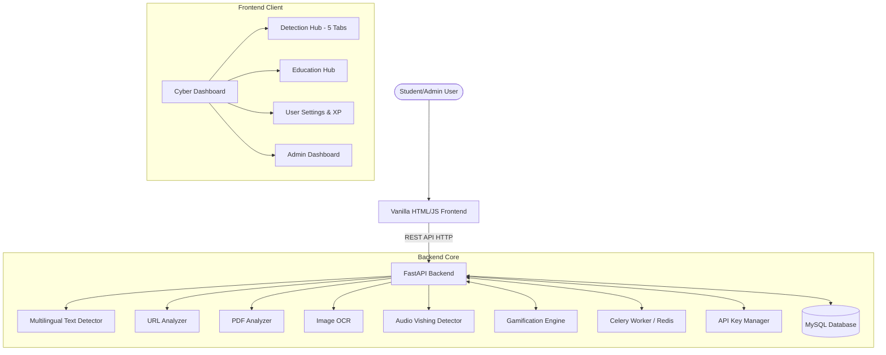

# System Architecture

CyberShield-EDU is a modern web application built with a decoupled frontend-backend architecture.

## High-Level Architecture

## 1. Frontend (Client-Side)
The frontend is a premium, responsive interface built with Vanilla HTML5, CSS3, and JavaScript.
* **Structure**: Modular HTML templates for different views (Detection, Education, Admin).
* **Styling**: Vanilla CSS with a custom "Glassmorphism" design system and multi-theme (Light/Dark) support.
* **State Management**: `app.js` and `gamification.js` manage global session state, XP counters, and level progression across all pages.
* **Data Fetching**: Standard `fetch` API utilized via a centralized `js/api.js` handler for uniform communication with the FastAPI backend.
* **Navigation**: Unified header navigation with a "Command Center" pill providing immediate access to user stats and logout.

## 2. Backend (Server-Side)
The backend is a high-performance Python server capable of handling asynchronous requests and machine learning inference.
* **Framework**: FastAPI provides asynchronous request handling, automatic OpenAPI (`/docs`) generation, and robust data validation with Pydantic.
* **Text Processing (AI)**:
  - Uses `distilbert-base-multilingual-cased` to support international student protection.
  - **Context Engine**: Implements a role-action conflict matrix to identify high-probability social engineering (e.g., Role: "Faculty" -> Action: "Request OTP").
* **Vision & Audio Scanning**:
  - `pytesseract` extracts text from image screenshots for multi-modal analysis.
  - **Audio Engine**: Transcribes voice notes using `SpeechRecognition` and scans transcriptions for vishing keywords and bank fraud patterns.
* **Asynchronous Workers**:
  - **Celery & Redis**: Offloads resource-intensive AI inference and file processing to background workers, ensuring a non-blocking UI for students.

## 3. Data Storage & Schema
CyberShield-EDU uses a robust relational schema hosted on MySQL to maintain session persistence and persistent security progress.

| Table | Purpose |
| :--- | :--- |
| `users` | Stores accounts, hashed passwords, XP, levels, and badges. |
| `scan_records` | Secure logs of all user scans for history tracking. |
| `awareness_content` | Educational modules, categories, and path ordering. |
| `verified_providers` | Trusted internship and scholarship repositories. |
| `quiz_questions` | Content for the "Spot the Scam" interactive quizzes. |
| `api_keys` | Hashed keys and usage quotas for external developers. |
| `scam_reports` | Community-submitted threat reports for admin review. |
| `scam_keywords` | Global heuristic library used by the detection engine. |
