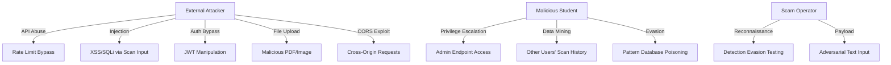
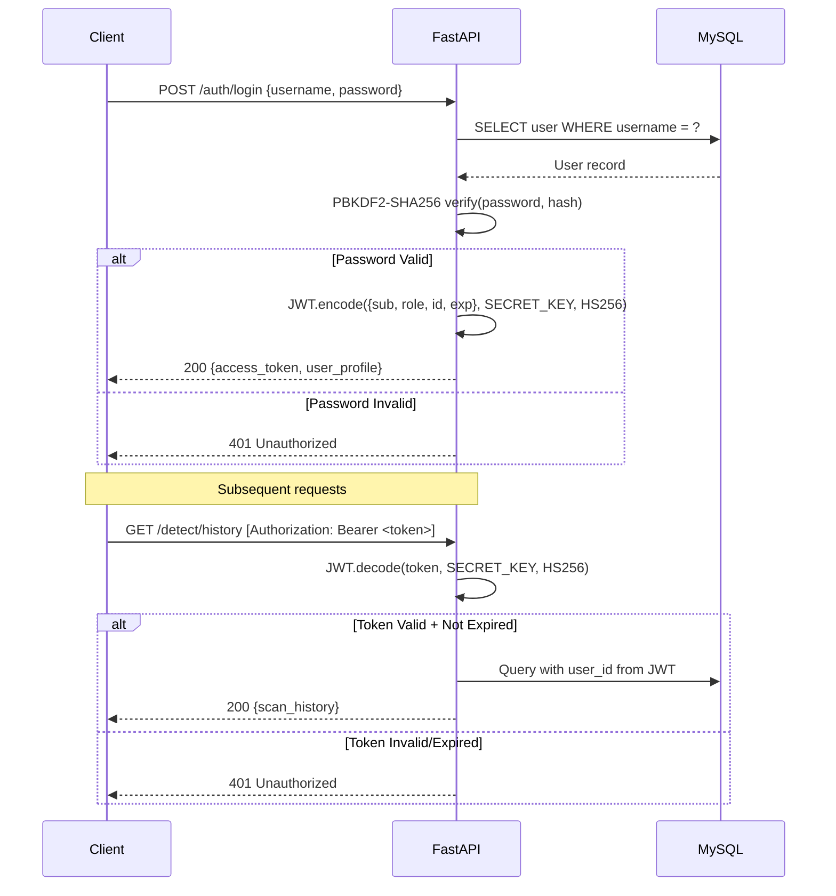

# Security Whitepaper — CyberShield-EDU

> A formal security analysis document covering the platform's own security posture, threat modeling, OWASP Top 10 mapping, authentication architecture, data protection mechanisms, and attack surface analysis. This whitepaper demonstrates that a platform designed to detect threats is itself built with security-first engineering.

---

## Table of Contents

1. [Executive Summary](#1-executive-summary)
2. [Threat Model](#2-threat-model)
3. [OWASP Top 10 (2021) Compliance Analysis](#3-owasp-top-10-2021-compliance-analysis)
4. [Authentication & Authorization Architecture](#4-authentication--authorization-architecture)
5. [Input Sanitization & Injection Prevention](#5-input-sanitization--injection-prevention)
6. [API Security](#6-api-security)
7. [Data Protection](#7-data-protection)
8. [Network Security](#8-network-security)
9. [Dependency Security](#9-dependency-security)
10. [Attack Surface Analysis](#10-attack-surface-analysis)
11. [Security Recommendations for Production](#11-security-recommendations-for-production)

---

## 1. Executive Summary

CyberShield-EDU is a cybersecurity platform that must meet a higher security standard than typical web applications — because a breach of a security tool would fundamentally undermine user trust. This whitepaper documents the security mechanisms implemented across the platform and identifies areas for hardening in production deployments.

**Security Posture: Development-Grade (Suitable for Local/Academic Use)**

The current implementation provides strong security primitives (hashed passwords, JWT auth, RBAC, rate limiting, input sanitization) appropriate for a development and academic demonstration environment. Production deployment would require additional hardening steps documented in Section 11.

---

## 2. Threat Model

### 2.1. Threat Actors

| Actor | Motivation | Capability |
|:---|:---|:---|
| **Malicious Student** | Abuse platform, bypass rate limits, harvest API keys | Low-Medium |
| **External Attacker** | Exploit vulnerabilities, inject payloads, steal credentials | Medium-High |
| **Scam Operator** | Evade detection, poison pattern database, test evasion techniques | Medium |
| **Insider Threat** | Admin account misuse, data exfiltration | Low |

### 2.2. Assets Under Protection

| Asset | Sensitivity | Location |
|:---|:---|:---|
| User credentials (hashed) | **Critical** | MySQL `users.hashed_password` |
| JWT secret key | **Critical** | `.env` file (`SECRET_KEY`) |
| API keys (hashed) | **High** | MySQL `api_keys.key_hash` |
| Scan history | **Medium** | MySQL `scan_records` |
| AI model weights | **Medium** | `~/.cache/huggingface/` |
| Uploaded evidence files | **Medium** | `uploads/reports/` |
| User PII (email) | **Medium** | MySQL `users.email` |

### 2.3. Attack Vectors



---

## 3. OWASP Top 10 (2021) Compliance Analysis

### A01:2021 — Broken Access Control

| Control | Implementation | Status |
|:---|:---|:---|
| Authentication enforcement | JWT token validation on protected endpoints | ✅ Implemented |
| Role-based authorization | `get_current_admin` dependency guard | ✅ Implemented |
| User data isolation | Scan history filtered by `user_id` from JWT | ✅ Implemented |
| Admin endpoint protection | HTTP 403 for non-admin roles | ✅ Implemented |
| Vertical privilege escalation | Role embedded in JWT, verified server-side | ✅ Mitigated |
| Horizontal privilege escalation | Users can only access their own scan records | ✅ Mitigated |

**Implementation Detail:**
```python
# Route-level access control via dependency injection
@router.get("/system/stats")
async def get_system_stats(admin=Depends(get_current_admin), db=Depends(get_db)):
    # Only reaches here if user.role == "admin"
    ...

# get_current_admin raises HTTPException(403) if role != "admin"
async def get_current_admin(current_user=Depends(get_current_user)):
    if current_user.get("role") != "admin":
        raise HTTPException(status_code=403, detail="Insufficient permissions")
```

---

### A02:2021 — Cryptographic Failures

| Control | Implementation | Status |
|:---|:---|:---|
| Password hashing | PBKDF2-SHA256 with high iteration count | ✅ Strong |
| JWT signing | HS256 with configurable secret key | ✅ Implemented |
| API key storage | SHA-256 one-way hash | ✅ Implemented |
| TLS/HTTPS | Not enforced (development mode) | ⚠️ Required for production |
| Credential rotation | JWT expires after 30 minutes | ✅ Implemented |

**Password Hashing Configuration:**
```python
from passlib.context import CryptContext

# Primary: PBKDF2-SHA256 (avoids bcrypt C-extension issues on Windows)
# Fallback: bcrypt (auto-deprecated if PBKDF2 is available)
pwd_context = CryptContext(schemes=["pbkdf2_sha256", "bcrypt"], deprecated="auto")
```

**Why PBKDF2-SHA256 over bcrypt:**
The platform runs on Windows student laptops where `bcrypt` C extensions occasionally fail to compile. PBKDF2-SHA256 is a NIST-recommended alternative with comparable security, using 600,000 iterations by default in passlib.

---

### A03:2021 — Injection

| Attack Type | Defense | Status |
|:---|:---|:---|
| SQL Injection | SQLAlchemy ORM parameterized queries | ✅ Mitigated |
| XSS (Stored) | HTML tag stripping via Sanitizer | ✅ Mitigated |
| XSS (Reflected) | HTML entity escaping | ✅ Mitigated |
| Command Injection | No shell commands from user input | ✅ N/A |
| JavaScript Protocol | `javascript:` URL prefix blocking | ✅ Mitigated |
| Path Traversal | Filename sanitization on file uploads | ✅ Mitigated |

**Sanitization Implementation:**
```python
class Sanitizer:
    @staticmethod
    def clean_text(text: str) -> str:
        # Stage 1: Remove HTML tags
        clean = re.sub(r'<[^>]*?>', '', text)
        # Stage 2: Unescape HTML entities
        clean = html.unescape(clean)
        # Stage 3: Strip non-printable characters
        clean = ''.join(char for char in clean if char.isprintable())
        return clean.strip()

    @staticmethod
    def sanitize_url(url: str) -> str:
        url = url.strip().replace('\n', '').replace('\r', '')
        # Block javascript: protocol injection
        if url.lower().startswith('javascript:'):
            return "blocked:unsafe-protocol"
        return url
```

**SQL Injection Prevention:**
All database queries use SQLAlchemy's ORM abstraction, which automatically uses parameterized queries:
```python
# SAFE — SQLAlchemy parameterizes this automatically
user = db.query(User).filter(User.username == username).first()

# NEVER used — raw SQL string formatting is NOT present in the codebase
# cursor.execute(f"SELECT * FROM users WHERE username = '{username}'")  ← Never happens
```

---

### A04:2021 — Insecure Design

| Concern | Mitigation | Status |
|:---|:---|:---|
| AI model adversarial inputs | Multi-layered detection (AI + heuristics) reduces single-point failure | ✅ Mitigated |
| Detection evasion | 9-layer URL analysis makes single-technique evasion insufficient | ✅ Mitigated |
| Pattern database poisoning | Admin-only access to pattern/keyword CRUD | ✅ Mitigated |
| XP farming abuse | 150 XP cap per educational reward call | ✅ Mitigated |
| File upload abuse | File type validation, Celery background processing | ✅ Mitigated |

---

### A05:2021 — Security Misconfiguration

| Configuration | Current State | Risk Level |
|:---|:---|:---|
| Debug mode | `DEBUG=True` (development default) | ⚠️ Change for production |
| Secret key | Hardcoded dev key in `.env` | ⚠️ Change for production |
| CORS origins | Explicit whitelist (not `*`) | ✅ Secure |
| Error messages | Generic 500 errors (no stack traces to client) | ✅ Secure |
| Default admin password | `admin123` in seed data | ⚠️ Change for production |
| OpenAPI/Swagger | Exposed at `/docs` | ⚠️ Disable for production |

---

### A06:2021 — Vulnerable and Outdated Components

| Component | Version | Known Issues |
|:---|:---|:---|
| FastAPI | Latest (0.100+) | No critical CVEs |
| SQLAlchemy | 2.0+ | No critical CVEs |
| PyTorch | 2.0+ | Large footprint, no auth CVEs |
| python-jose | Latest | Monitor for JWT library updates |
| passlib | Latest | Stable, well-maintained |

**Mitigation:** Regular `pip install --upgrade` cycles and monitoring of `pip audit` output.

---

### A07:2021 — Identification and Authentication Failures

| Control | Implementation | Status |
|:---|:---|:---|
| Password complexity | Not enforced (development) | ⚠️ Add for production |
| Account lockout | Not implemented | ⚠️ Recommended |
| Brute force protection | Rate limiting (5 req/min) applies to all endpoints | ✅ Partial |
| Session management | Stateless JWT with 30-min expiry | ✅ Implemented |
| Token invalidation | Not implemented (JWT is stateless) | ⚠️ Limitation of JWT |

---

### A08:2021 — Software and Data Integrity Failures

| Control | Implementation | Status |
|:---|:---|:---|
| Dependency integrity | `pip install` from PyPI (trusted source) | ✅ Standard |
| File upload validation | MIME type checking, extension validation | ✅ Implemented |
| AI model integrity | Downloaded from Hugging Face Hub (signed) | ✅ Standard |

---

### A09:2021 — Security Logging and Monitoring Failures

| Control | Implementation | Status |
|:---|:---|:---|
| Request logging | Custom middleware logs method, path, status | ✅ Implemented |
| Error logging | Global exception handler with context | ✅ Implemented |
| Audit trail | All scans recorded in `scan_records` table | ✅ Implemented |
| Log file | `logs/app.log` with rotation | ✅ Implemented |
| Failed login logging | Logged via request middleware | ✅ Partial |

**Logger Configuration:**
```python
import logging
from logging.handlers import RotatingFileHandler

handler = RotatingFileHandler("logs/app.log", maxBytes=5_000_000, backupCount=3)
logger = logging.getLogger("CyberShield")
logger.setLevel(logging.INFO)
logger.addHandler(handler)
```

---

### A10:2021 — Server-Side Request Forgery (SSRF)

| Vector | Defense | Status |
|:---|:---|:---|
| URL deep scan | Fetches arbitrary user-supplied URLs | ⚠️ Risk — mitigated by timeout (10s) and SSL bypass |
| URLScan.io API | Server-initiated requests to external API | ✅ Low risk (trusted API) |
| Internal network probing | No explicit SSRF protection | ⚠️ Recommended for production |

**Risk Assessment:** The URL deep scan feature (`_deep_scan`) makes outbound HTTP requests to user-supplied URLs. In a production environment, this should be restricted to prevent internal network scanning (e.g., `http://localhost:3306` targeting the database port).

---

## 4. Authentication & Authorization Architecture

### 4.1. Authentication Flow



### 4.2. JWT Payload Structure

```json
{
    "sub": "student_jdoe",    // Username (subject)
    "role": "student",         // RBAC role
    "id": 4,                   // Database user ID
    "exp": 1744393200          // Expiry timestamp (30 min from issue)
}
```

### 4.3. Access Control Matrix

| Endpoint Category | Guest | Student | Admin |
|:---|:---|:---|:---|
| Detection (scan) | ✅ (no XP) | ✅ (with XP) | ✅ (with XP) |
| Scan History | ❌ | ✅ (own data) | ✅ (own data) |
| Gamification Profile | ❌ | ✅ | ✅ |
| Quiz Questions | ✅ | ✅ | ✅ |
| Quiz Submission (XP) | ❌ | ✅ | ✅ |
| Scam Reporting | ✅ | ✅ | ✅ |
| Admin Statistics | ❌ | ❌ | ✅ |
| Pattern Management | ❌ | ❌ | ✅ |
| Keyword Management | ❌ | ❌ | ✅ |
| Public API | API Key | API Key | API Key |

---

## 5. Input Sanitization & Injection Prevention

### 5.1. Sanitization Pipeline

Every user-provided text and URL input passes through sanitization before reaching detection engines:

```
User Input
     │
     ▼
┌─────────────────────────────────┐
│ sanitizer.clean_text()           │
│  1. Strip HTML tags (regex)      │
│  2. Unescape HTML entities       │
│  3. Remove non-printable chars   │
│  4. Trim whitespace              │
└─────────────┬───────────────────┘
              │
              ▼
┌─────────────────────────────────┐
│ Length Capping                    │
│  Text: [:3000] characters        │
│  URL: Validated via urlparse     │
└─────────────┬───────────────────┘
              │
              ▼
Detection Engine
```

### 5.2. URL Protocol Blocking

```python
if url.lower().startswith('javascript:'):
    return "blocked:unsafe-protocol"
```
Prevents `javascript:alert(1)` style payloads from being processed or stored.

### 5.3. File Upload Security

| Control | Implementation |
|:---|:---|
| File size limit | FastAPI default upload limits |
| Extension validation | Accepted: `.pdf`, `.jpg`, `.jpeg`, `.png`, `.bmp` |
| Filename sanitization | Timestamped rename prevents path traversal |
| Processing isolation | Files processed in Celery workers, not in API thread |
| Cleanup on failure | Failed database saves trigger uploaded file deletion |

---

## 6. API Security

### 6.1. Rate Limiting

```python
from slowapi import Limiter
from slowapi.util import get_remote_address

limiter = Limiter(key_func=get_remote_address)

# Applied to detection endpoints:
@limiter.limit("5/minute")
async def detect_text(request: Request, ...):
    ...
```

| Endpoint Group | Limit | Key |
|:---|:---|:---|
| Detection (text, URL, PDF, image) | 5 requests/minute | Client IP address |
| Scam reporting | 3 requests/minute | Client IP address |
| Public API | 1000 requests/day | API key hash |

### 6.2. API Key Security

```python
import hashlib

# Key Generation
raw_key = f"cs_{secrets.token_hex(32)}"      # e.g., cs_a1b2c3d4...
key_hash = hashlib.sha256(raw_key.encode()).hexdigest()

# Storage: Only key_hash is stored in database
# The raw_key is shown to the user ONCE and never stored

# Validation
def validate_api_key(incoming_key: str, db: Session):
    incoming_hash = hashlib.sha256(incoming_key.encode()).hexdigest()
    key_record = db.query(ApiKey).filter(
        ApiKey.key_hash == incoming_hash,
        ApiKey.is_active == True
    ).first()
    ...
```

### 6.3. Sandbox Mode

The public API supports a sandbox mode for testing:
```python
if request.headers.get("X-Sandbox") == "true":
    return {"prediction": "safe", "confidence": 0.1, "sandbox": True}
```
This bypasses actual analysis and returns simulated results without consuming quota.

---

## 7. Data Protection

### 7.1. Data at Rest

| Data | Protection | Location |
|:---|:---|:---|
| Passwords | PBKDF2-SHA256 hash (irreversible) | MySQL `users.hashed_password` |
| API keys | SHA-256 hash (irreversible) | MySQL `api_keys.key_hash` |
| Scan input | Plaintext (for history display) | MySQL `scan_records.input_data` |
| Evidence files | Filesystem storage (no encryption) | `uploads/reports/` |

### 7.2. Data in Transit

| Path | Protection | Status |
|:---|:---|:---|
| Frontend ↔ Backend | HTTP (development) | ⚠️ Use HTTPS in production |
| Backend ↔ MySQL | Unencrypted (localhost) | ✅ Acceptable for localhost |
| Backend ↔ Redis | Unencrypted (localhost) | ✅ Acceptable for localhost |
| Backend ↔ URLScan.io | HTTPS | ✅ Encrypted |
| Backend ↔ Hugging Face | HTTPS | ✅ Encrypted |

### 7.3. Data Retention

| Data Type | Retention Policy |
|:---|:---|
| User accounts | Indefinite until deletion |
| Scan records | Indefinite (CASCADE on user delete) |
| Uploaded evidence | Indefinite (filesystem) |
| API key usage counts | Reset every 24 hours |
| Application logs | 5MB rotating, 3 backups |

---

## 8. Network Security

### 8.1. CORS Configuration

```python
app.add_middleware(
    CORSMiddleware,
    allow_origins=settings.ALLOWED_ORIGINS,  # Explicit whitelist, NOT "*"
    allow_credentials=True,
    allow_methods=["*"],
    allow_headers=["*"],
)
```

**Configured Origins (Development):**
```
http://localhost:5173
http://127.0.0.1:5173
http://localhost:8080
http://localhost:3000
http://127.0.0.1:3000
http://localhost:5500
http://127.0.0.1:5500
```

**Key Decision:** Using explicit origin whitelist instead of `allow_origins=["*"]` because `allow_credentials=True` is enabled for JWT cookie/header transmission. Wildcard origins with credentials would cause CORS errors in browsers.

### 8.2. Port Exposure

| Port | Service | Binding | Risk |
|:---|:---|:---|:---|
| 8000 | FastAPI | `0.0.0.0` | ⚠️ Accessible on LAN |
| 8080 | Frontend | `0.0.0.0` | ⚠️ Accessible on LAN |
| 3306 | MySQL | `127.0.0.1` | ✅ Localhost only |
| 6379 | Redis | `127.0.0.1` | ✅ Localhost only |

---

## 9. Dependency Security

### 9.1. Critical Dependencies

| Package | Risk Assessment | Justification |
|:---|:---|:---|
| `fastapi` | Low | Well-maintained, active security advisories |
| `python-jose` | Medium | JWT library — monitor for algorithm confusion attacks |
| `passlib` | Low | Mature password hashing library |
| `torch` | Low (security) | Large attack surface but no auth/network exposure |
| `pdfplumber` | Medium | Processes untrusted PDF files — potential parser exploits |
| `pytesseract` | Low | Subprocess call to Tesseract binary |
| `opencv-python` | Medium | Image processing of untrusted files |
| `aiohttp` | Medium | Makes outbound HTTP requests to user-supplied URLs |

### 9.2. Supply Chain Risks

| Risk | Mitigation |
|:---|:---|
| Malicious PyPI package | Use well-known, high-download packages only |
| Dependency confusion | All packages sourced from PyPI (default index) |
| Transitive vulnerabilities | Regular `pip audit` scans recommended |

---

## 10. Attack Surface Analysis

### 10.1. External Attack Surface

| Surface | Exposure | Protection |
|:---|:---|:---|
| FastAPI HTTP endpoints | 22+ routes | Auth + Rate Limiting + Sanitization |
| File upload endpoints | PDF + Image | Type validation + Background processing |
| OpenAPI documentation | `/docs`, `/redoc` | Public (disable in production) |
| Outbound HTTP (deep scan) | Fetches arbitrary URLs | 10s timeout, no auth headers sent |
| Redis (if exposed) | Port 6379 | Bind to localhost |
| MySQL (if exposed) | Port 3306 | Bind to localhost, no root password |

### 10.2. Internal Attack Surface

| Surface | Risk | Mitigation |
|:---|:---|:---|
| JWT secret in `.env` | File access = full impersonation | Restrict file permissions |
| Database with no root password | Local access = full data access | XAMPP development setup |
| AI model cache | Model tampering | Read-only after download |
| Celery task queue | Task injection via Redis | Bind Redis to localhost |

---

## 11. Security Recommendations for Production

### 11.1. Critical (Must-Do Before Public Deployment)

| # | Recommendation | Current Risk |
|:---|:---|:---|
| 1 | **Generate cryptographically random SECRET_KEY** | Dev key is predictable |
| 2 | **Enable HTTPS/TLS** (Nginx reverse proxy with Let's Encrypt) | All traffic is plaintext |
| 3 | **Change default admin password** | `admin123` is guessable |
| 4 | **Set DEBUG=False** | Debug mode exposes internal state |
| 5 | **Disable Swagger UI** (`openapi_url=None`) | Exposes full API surface |
| 6 | **Set MySQL root password** | No authentication on database |
| 7 | **Add Redis authentication** (`requirepass`) | No authentication on broker |
| 8 | **Implement SSRF protection** for URL deep scan | Internal network probing risk |

### 11.2. High Priority (Recommended)

| # | Recommendation |
|:---|:---|
| 9 | Add password complexity requirements (min 8 chars, mixed case) |
| 10 | Implement account lockout after 5 failed login attempts |
| 11 | Add CSRF protection for state-changing operations |
| 12 | Implement JWT token blacklisting for logout |
| 13 | Add Content-Security-Policy headers |
| 14 | Implement file upload virus scanning (ClamAV) |
| 15 | Add database connection encryption (SSL/TLS) |

### 11.3. Medium Priority (Best Practice)

| # | Recommendation |
|:---|:---|
| 16 | Implement request signing for critical operations |
| 17 | Add IP-based geofencing for admin access |
| 18 | Implement audit logging to a separate, append-only store |
| 19 | Add automated dependency vulnerability scanning (Dependabot/Snyk) |
| 20 | Implement rate limiting per user (not just per IP) |

---

*This whitepaper demonstrates that CyberShield-EDU's security architecture follows industry best practices for academic deployment while identifying clear hardening steps for production environments.*
